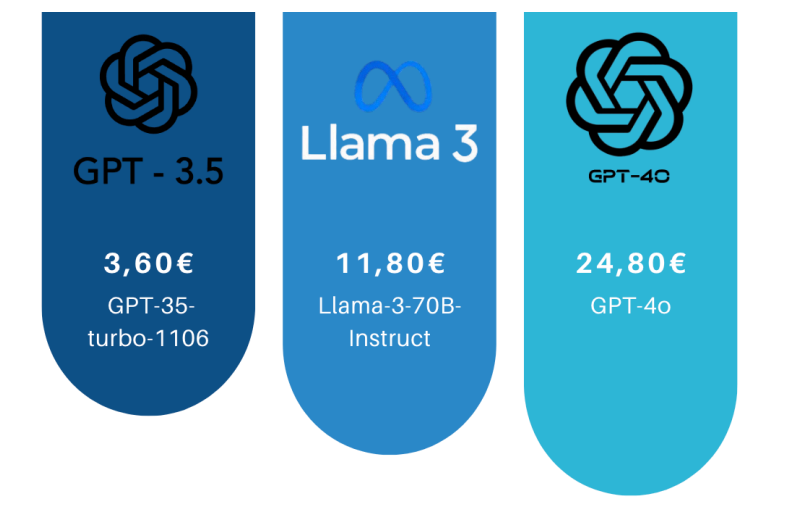

# Appendix: Exploring the Use of LLMs for Requirements Specification in an IT Consulting Company  

Welcome to the supplementary materials accompanying the paper:  

**_"Exploring the Use of LLMs for Requirements Specification in an IT Consulting Company"_**  

This repository provides extended analyses, additional experimental results, and supporting resources that complement our main study.  

## 📌 Abstract  
<p align="justify">
In many industries, the process of requirements specification remains a critical challenge. Organizations often struggle to accurately capture and communicate complex system needs, leading to potential misalignments between stakeholders and increased costs. Requirements are typically specified using a Functional Design Specification (FDS), a document that outlines the functional requirements and features of a system, application, or process.
In practice, the knowledge required to generate a FDS is usually fragmented across diverse documents (e.g., meeting minutes, emails, and high-level product descriptions). This makes the specification of the FDS a cumbersome and time-consuming process. This work investigates the potential of Large Language Models (LLMs) to automate FDS generation, aiming to reduce effort while maintaining quality.

In this experience paper, we explore the role of LLMs in automating the generation of the FDS in an IT project, involving the management of digital rights, developed by an IT consulting company.We provide LLMs with summarized requirements elicitation documents and FDS templates, prompting them to generate Epic FDS (including high-level product descriptions) and user stories, subsequently compiled into a complete FDS document.
We compared the correctness and quality of the FDS generated by three state-of-the-art LLMs (GPT3-turbo, GPT-4o, and Llama-3-70B)  against those produced by human analysts.
Our results show that LLMs can help automate and standardize the generation of documentation, reducing the time and manual effort required. However, the quality of  LLM-generated FDS highly depends on inputs and often requires human revision.

This study advocates for a synergistic approach where LLM serves as an effective drafting tool while human analysts provide the critical contextual and technical oversight necessary for high-quality RE documentation.
</p>

## 🔍 Insights
### Efficiency and Cost Analysis:
<p align="justify">
This experiment, evaluate the computational efficiency and cost of implementation and use of LLMs for RE tasks. The analysis focuses on comparing the models over terms such as their token consumption, processing speed, financial cost, and overall effectiveness. The goal of this analysis is to determine which model offers the best trade-off between cost, efficiency, and accuracy when generating requirements documentation, including user stories, Epic FDS, and FDS.

Computational efficiency of the models assessed based on speed of generation, understanding how quick each model produces documents, verbosity and redundancy by understanding the model tendency to generate excessive or repetitive information, handling of complex requirements on the model ability to capture detailed technical specification accurately, and token limitations which is the model restriction of the input context windows.
</p>

- <p align="justify"> <b>Speed and Processing Time:</b> In this context, each model showed a unique characteristic in speed and output generation. GPT4, generated the most structured, contextually relevant documentation, making it the best choice for technical accuracy. In counter part, since the model tended to produce extensive descriptions, this behavior led to increasing token usage and response time therefore its processing speed was slower due to its ability to generate detailed and complex outputs. The examination also showed GPT3 was significantly faster but highly redundant. It frequently rephrased similar content multiple times, leading to unnecessary token consumption. While it could generate user stories quickly, the manual effort required to filter out redundant text made it less efficient in practical scenarios. Llama also revealed that it is the most computationally lightweight model and generated concise and efficient outputs. However, it struggled to maintain technical depth and specificity, often requiring manual expansion by human analysts. This trade-off made it more useful for high-level documentation but less suitable for detailed functional specifications.</p>
- <p align="justify"><b>Handling of Token Limits:</b> A major challenge during experimentation was the limitation of token context windows, particularly for GPT3 and Llama-3, which have smaller input capacities compared to GPT4. To answer this limitation for models, raw input data (e.g., requirement lists, meeting notes, regulatory documents) had to be summarized manually before feeding it into the models. This summarization not only added an extra processing step to process, but also increased the risk of critical information loss, leading to less efficiency for the models. In this case, GPT4’s extended token capacity made it well-suited for handling long technical documents, reducing the need for excessive summarization.</p>
- <p align="justify"><b>Cost Analysis:</b> The result has been reported for cost per 1,000 tokens, total token usage for each model and overall expenditure on cloud computing resources. The result revealed that GPT4 was the most expensive model primarily due to its high output cost and extensive token generation. In counter part, GPT3 was the cheapest model but its redundancy meant that token efficiency was lower, requiring additional human revision. Llama fell in the middle, offering a cheaper alternative than GPT4 while still providing structured outputs.</p>
</p>

Presented below are the input/output and total costs associated with each model in this experiment.


<table style="width:100%;">
  <tr>
    <td style="width:50%; vertical-align: top; padding-right: 20px;">
      <table style="width:100%; text-align: center;">
        <thead>
          <tr>
            <th colspan="3" style="text-align: center;">Costs of Each Model for 1000 Tokens</th>
          </tr>
          <tr>
            <th>Model</th>
            <th>Input Cost</th>
            <th>Output Cost</th>
          </tr>
        </thead>
        <tbody>
          <tr>
            <td>GPT3</td>
            <td>0.0010</td>
            <td>0.0019</td>
          </tr>
          <tr>
            <td>GPT4</td>
            <td>0.0047</td>
            <td>0.0141</td>
          </tr>
          <tr>
            <td>Llama</td>
            <td>0.0034</td>
            <td>0.0099</td>
          </tr>
        </tbody>
      </table>
    </td>
    <td style="width:300px; text-align:center; vertical-align: top;">
      
    </td>
  </tr>
</table>

<p align="justify">
To conclude, GPT4 offers the highest accuracy and structured documentation but at a significantly higher cost, making it suitable for projects requiring minimal manual refinement. GPT3, although it’s cost-effective, suffers from redundancy, requiring substantial human intervention to refine outputs, which can offset its financial advantage. Llama, while more efficient in token usage, lacks technical depth, making it a viable choice for high-level summarization rather than detailed requirement specifications.
</p>

👉 For a detailed evaluation based on expert feedback and TAM analysis, see [Expert Feedback and TAM Evaluation](./Interview%20with%20Analyst/Expert-Feedback-And-TAM-Evaluation.md).


<br>

## 📂 Contents  
This repository includes:  
✅ **Project workflow diagram** – A visual representation of the different stages of the project.  
✅ **Project phase tables** – A structured breakdown of inputs, activities, and outputs for each phase.  
✅ **User Story Template (Jira)** – A structured format for defining user stories in JIRA.  
✅ **Epic FDS Template (Confluence)** – For documenting Functional Design Specifications for Epics.  
✅ **FDS Template (Confluence)** – For documenting Functional Design Specifications.  
✅ **Prompts** – Structured prompts and instructions for guiding LLMs in each step of the project.  
✅ **Interview on LLM-generated documentation** - Feedback and evaluation of model-generated documents from the functional analyst's point of view.  
✅ ...  


## 📁 Repository Structure  
```
📦 repository-root
 ┣ 📂 analyst interview/                   
 ┃ ┃ 📂 analyst interview.md                    # Contains the results of the interview with the analyst on the documentation generated
 ┃ ┗ 📂 Expert-Feedback-And-TAM-Evaluation.md   # Details of TAM evaluation by experts          
 ┣ 📂 workflow/                                 # Contains the project workflow diagram  
 ┣ 📂 Prompts/                      
 ┃ ┣ 📂 Step 1 Prompts/                         # Contains prompts for Step 1 of the workflow
 ┃ ┣ 📂 Step 2 Prompts/                         # Contains prompts for Step 2 of the workflow
 ┃ ┣ 📂 Step 3 Prompts/                         # Contains prompts for Step 3 of the workflow
 ┃ ┗ 📂 Step 4 Prompts/                         # Contains prompts for Step 4 of the workflow
 ┣ 📂 phases/                                   # Tables detailing each project phase  
 ┣ 📂 templates/                    
 ┃ ┣ 📂 Fincons template/                       # US, Epic FDS and FDS templates used by Fincons
 ┃ ┣ 📂 template provided to LLMs/              # US, Epic FDS and FDS templates provided to LLMs
 ┣ 📂 miscellaneous/                            # Contains miscellaneous files
 ┗ 📄 README.md                                 # This document  

```
